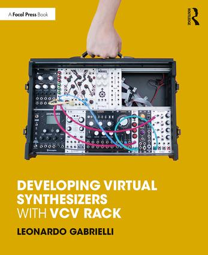

# VCVBook - Developing Virtual Synthesizers with VCV Rack - ABC Plugin


This repository contains material and examples related to the book:
"Developing Virtual Synthesizers with VCV Rack",
edited by Focal Press.

Find the book at:
https://www.routledge.com/Developing-Virtual-Synthesizers-with-VCV-Rack/Gabrielli/p/book/9780367077730

The ABC plugin contains all modules described in the book. 

# NOTE: The plugins are ready for RACK v2!

You will find all the instructions in the book.
For building ABC, clone this repository and copy the ABC folder in your Rack installation "plugins" folder, i.e.:
```
git clone https://github.com/LOGUNIVPM/VCVBook.git
cp -r VCVBook/ABC <myRackInstallationFolder>/plugins/
cd <myRackInstallationFolder>/plugins/ABC/
```
Now you are ready to build and tweak.

All material is released under a GPLv3 license, except when differently stated.

Please note: these examples are for didactical purposes only. They are not necessarily meant to be ideal, whatever this means. The book often provides a discussion on alternative ways to implement things, with pros and cons. Do not learn by Ctrl+C and Ctrl+V! 
